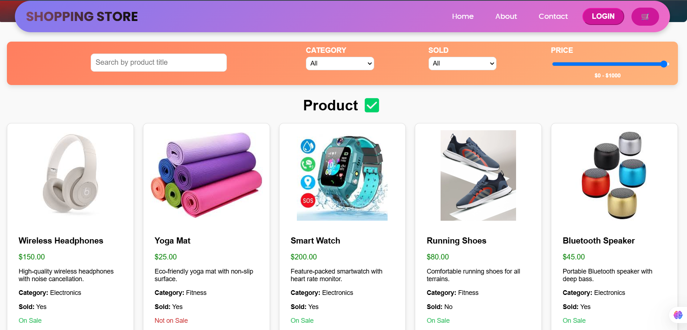

# E-Commerce Website Frontend

## Project Overview

 This project is the frontend of an e-commerce website built using React.js. It provides a user-friendly interface for browsing and purchasing products. The frontend communicates with the backend via RESTful APIs and supports features such as product listing, user authentication, and a shopping cart.

### Key Features:

1)  Product Display: View product details fetched from the backend.

2) Shopping Cart: Add, remove, and manage products in the cart.

3) Responsive Design: Ensures compatibility across devices.


### SHOPPING STORE


## Instructions to Run the Project Locally

### Prerequisites

1) Node.js installed on your system.

3) npm (Node Package Manager) for installing dependencies.

### staps
Clone the Repository
```bash
   git clone https://github.com/Aayushajs/E-COMERCE-FRONTEND.git
   cd ./frontend
```
Install Dependencies
```bash
npm install
```
 
Run the Server
```
npm start
```
The server will start on the specified port (default is 3000) and connect to the MongoDB database

### Access the API
Use a web browser to visit http://localhost:3000 and explore the application’s features.


## Live Demo
The frontend is deployed and can be accessed at:
<a href="https://e-stores1.netlify.app/"><strong>➥ Live Demo</strong></a>


## Screenshots

Include relevant screenshots demonstrating the application functionality:

1) Product List API Response:





## Technologies Used

**React.js**:  Frontend library for building user interfaces

**Axios**: HTTP client for making API requests.

**React Router**: Library for handling navigation and routing.

**chart.js**: making graph and chart 

## License

This project is licensed under the MIT License.


## Support
For any questions or suggestions, please contact aayushj004@gmail.com.


## file structure
```
frontend/
├── src/
│   ├── components/
│   │   ├── Header.js           # Header and navigation bar
│   │   ├── Footer.js           # Footer section
│   │   ├── ProductCard.js      # Displays individual product details
│   │   └── Cart.js             # Manages shopping cart functionality
│   ├── pages/
│   │   ├── HomePage.js         # Home page layout
│   │   ├── ProductPage.js      # Product details page
│   │   └── LoginPage.js        # User login page
│   ├── utils/
│   │   └── api.js              # API service for making backend requests
│   ├── App.js                  # Main application component
│   └── index.js                # Entry point of the application
├── .env                         # Environment variables
├── package.json                 # Project dependencies and scripts
└── public/
    └── index.html               # Main HTML template
```
## File Roles
### (1) components/:
Reusable UI components such as headers, footers, and product cards.

### (2) pages/:

Defines different page layouts and their respective functionality.

### (3) utils/:

 Contains helper functions and API services for interacting with the backend.

### (4)  App.js:

The main component that integrates all routes and pages.
Would you like boilerplate code for any specific file?
 
